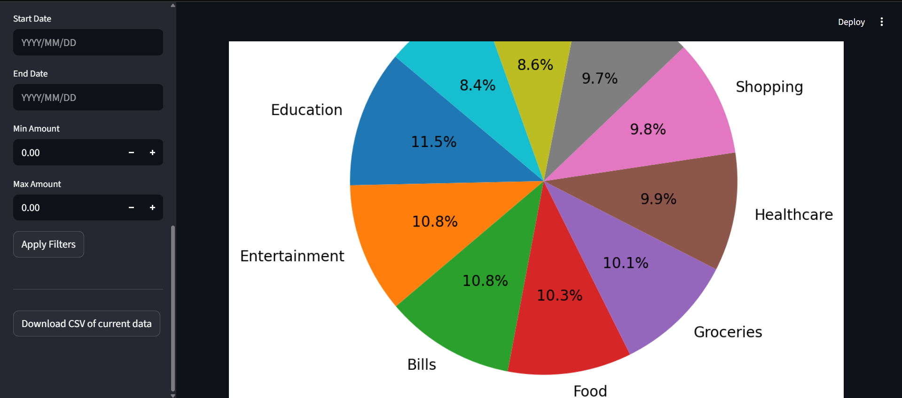

# 📊 Smart Expense Tracker

A simple **Streamlit web app** to track personal expenses, analyze spending patterns, and generate visual reports.  
Built with **Python**, using only:
- [numpy](https://numpy.org/)  
- [pandas](https://pandas.pydata.org/)  
- [matplotlib](https://matplotlib.org/)  
- [seaborn](https://seaborn.pydata.org/)  
- [streamlit](https://streamlit.io/)

---

## 🚀 Features
- Add new expenses with date, category, amount, and description.
- Save and load all expenses from **`expenses.csv`**.
- Apply filters:
  - by **category**
  - by **date range**
  - by **min/max amount**
- Get summary metrics:
  - total spent, average, median, and number of transactions
  - breakdown by category
- Visualizations:
  - Bar chart (total by category)
  - Line chart (monthly spending)
  - Pie chart (distribution by category)
  - Histogram (expense amount distribution)
- Export data:
  - Download current dataset
  - Download filtered dataset
  - Generate category summary CSV

---

## 📂 Project Structure
```
├── expense_tracker.py    # main app (Streamlit + ExpenseTracker class)
├── requirements.txt      # dependencies
├── expenses.csv          # generated dataset (created automatically if missing)
```

---

## ⚙️ Installation

Clone the repository or copy the project folder:

```bash
git clone https://github.com/Prath-Digital/Python_Practical-Test.git
cd Python_Practical-Test
```

Install dependencies:

```bash
python -m pip install -r requirements.txt
```

---

## ▶️ Run the App

```bash
python -m streamlit run expense_tracker.py
```

Streamlit will print a local URL, usually:  
```
Local URL: http://localhost:8501
```
Open it in your browser.

---

## 🗂 Data
- All expenses are stored in **`expenses.csv`** in the same folder as the app.  
- The file will be created automatically if it doesn’t exist.  
- You can manually edit or pre-populate it — make sure it has the following headers:

```csv
Date,Amount,Category,Description
```

Example:
```csv
Date,Amount,Category,Description
2024-06-04,1794.09,Shopping,Shoes
2024-04-26,1176.24,Education,Online course
2023-10-15,3009.83,Miscellaneous,Gift
2024-08-22,2702.55,Healthcare,Doctor visit
2023-06-14,304.52,Entertainment,Concert
```

---

## 📑 Requirements
See [requirements.txt](requirements.txt)

```
numpy
pandas
matplotlib
seaborn
streamlit
```

---

## 🔄 Resetting Data
Click **“Reset all data”** in the app to clear `expenses.csv` and start fresh.

---

## 🖼️ Preview

### 📸 Screenshots





### 🖼️ All in one GIF


---

## ℹ️ About
Smart Expense Tracker is a minimal, privacy-friendly personal finance tool built for simplicity and clarity. It is designed for students, professionals, and anyone who wants to track expenses without sharing data online. All data stays on your device.

## 🤝 Contributing
Contributions, suggestions, and bug reports are welcome! Feel free to fork the repository, open issues, or submit pull requests.

## 📬 Contact
- Author: Prath-Digital
- GitHub: [Prath-Digital](https://github.com/Prath-Digital)
- Email: [askforvarn@gmail.com](https://mail.google.com/mail/u/0/?fs=1&to=askforvarn@gmail.com&su=Topic&body=Hi+Prath%20Digital%0A%0AI+want+to+ask+about+...%0A%0AThanks,%0AYour+Name&tf=cm)

## 📄 License
This project is licensed under the MIT License.


